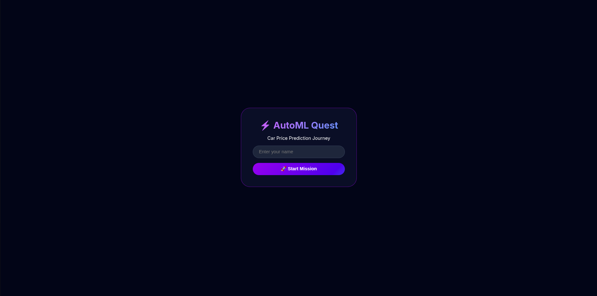
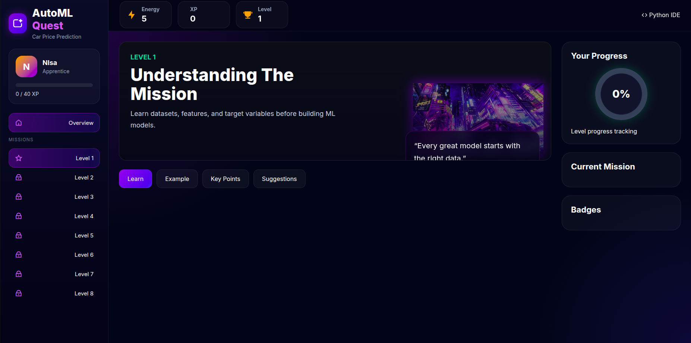
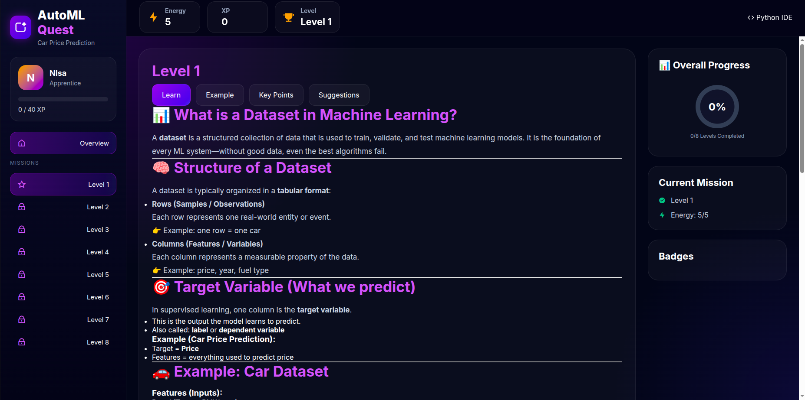
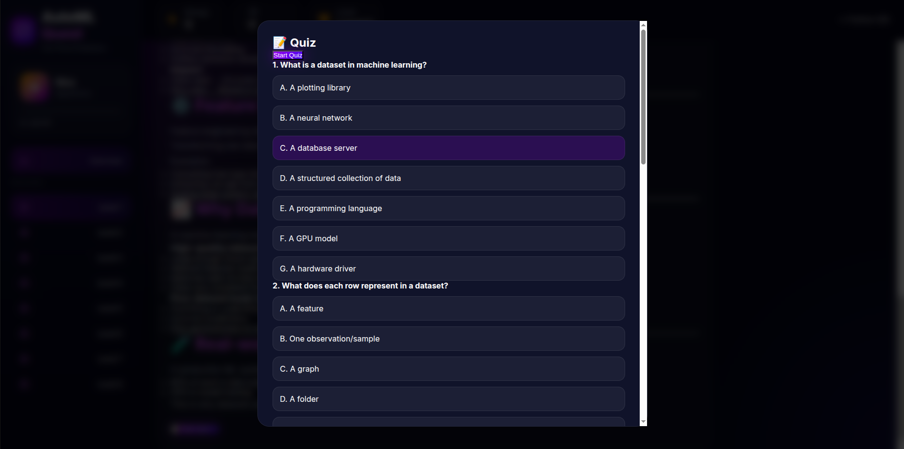
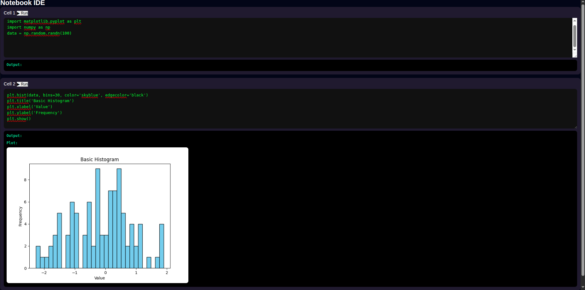

🚗 Predict Garage – Phase 1
📌 Overview

Predict Garage is an interactive, game-based Machine Learning learning platform designed to make ML/DL concepts engaging, intuitive, and beginner-friendly.

This is Phase 1 of the project, where the main focus is validating the core idea:
👉 whether a fully interactive IDE-based learning system can help beginners understand Machine Learning in a more enjoyable and gamified way.

Instead of traditional passive learning, this project turns ML learning into a structured game progression system.

🎯 Phase 1 Goal

In this phase, the primary focus is:

Ensuring the in-browser Python IDE works smoothly
Helping users run ML-related code interactively
Providing guided suggestions with both correct and incorrect code patterns
So users cannot blindly copy-paste solutions
They are encouraged to understand and compare outputs

The aim is to create a learning-first environment, not a copy-paste environment.

🎮 Gamified Learning System

To make learning engaging, the system is designed like a game:

⭐ XP System
Each level contains 5 quizzes
Completing all quizzes in a level gives +5 XP
Each wrong answer deducts XP
If XP reaches 0, the user cannot continue quizzes temporarily
XP can be recovered after a 2-minute cooldown, encouraging revision instead of random guessing
🧠 Learning Flow
Users are encouraged to think before submitting answers
Incorrect attempts trigger a cooldown period
This prevents blind guessing and promotes real understanding
🏆 Levels & Progression
The system contains 8 structured levels
Each level represents a progressive learning stage
Completion of a level unlocks a new badge
A progress bar visually tracks learning advancement
🧩 Project Theme (Phase 1 Focus)

This phase is built around a simple but widely used ML project:

Car Price Prediction
It is used as the foundation to introduce:

Data understanding
Basic ML workflow
Model building concepts
Python-based experimentation in the IDE

Even though it is a common beginner project, it is transformed into a structured learning experience.

🖼️ UI Screenshots

The interface includes the following screens:

## 📸 Screenshots

### Login Scene

### Dashboard

### Level System

### Quiz Interface

### Python IDE

These screens represent the full Phase 1 user journey.

🧠 Key Design Philosophy

This project is built with a simple principle:

“Learning Machine Learning should feel like playing a game, not reading a textbook.”

To support this:

The system mixes coding + quizzes + feedback loops
Users learn through experimentation, not memorization
Anti-copy-paste logic ensures real understanding
🚀 What’s Next (Future Phases)

Phase 2 will focus on:

More advanced ML/DL projects
Smarter AI-based hints
Adaptive difficulty system
Real-world datasets integration
Community-based learning challenges

